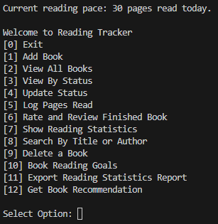
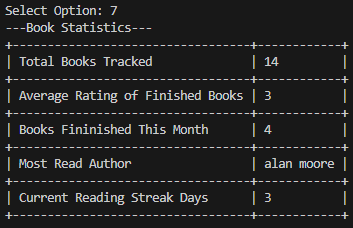
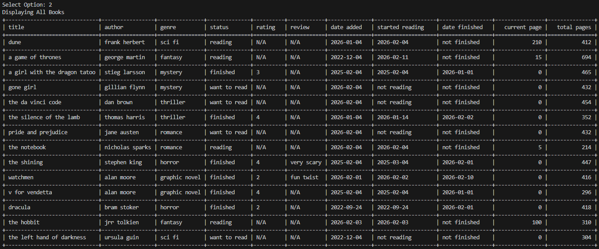

markdown

# Reading List Tracker

A command-line book tracking application. You can track books, log reading progress, set goals, and generate reading statistics! I built this project to practice working with modular functions, saving/loading from files, and data logic.

## Features
- 📖 Add and delete book. User can add book including title, author, status, rating, and optional review.
- 🖥️ Display all books or books by status.
- 🔄 Change book status, rating, or review.
- 🔍 Search by title or author.
- 🎯 Track and display reading pace and reading goal.
- 📤 Export reading statistics CSV report.
- 🎲 User can ask to be recommended a book from "Want to Read" list.
- 📊 Statistics report including total books, average rating, books finished per month, most read author, and reading streak.


## How to Run
```
bash
git clone https://github.com/andreigurd/reading-list
cd reading-list
pip install tabulate
python reading_list.py
```
**Prerequisites:**
- Python 3.x
- pip packages: `tabulate`.

## 📸 Screenshots




## 🧠 What I Learned
- Using event activated flag variables to only allow actions if for example a book is finished was very valuable. 
- Learning date tracking for streak calculation was difficult with requirement to break and reset if any days are missed.
- I would have approached the reading goal status feature differently. It would be helpful for user to choice if goal is for day, month, or year.
- Utilizing OS to export to CSV file and display directory of file location to user.
- How to use random feature with validation to avoid issues to select from a user input list.

## 🔮 Future Improvements
- Improve search function to allow partial matches.
- Expand reading goal to allow user to choose day, month, or year as well as pages or books.
- Consolidate saved data to one JSON file.

## 🤝 Contributing
This is a learning project, but feedback is welcome!